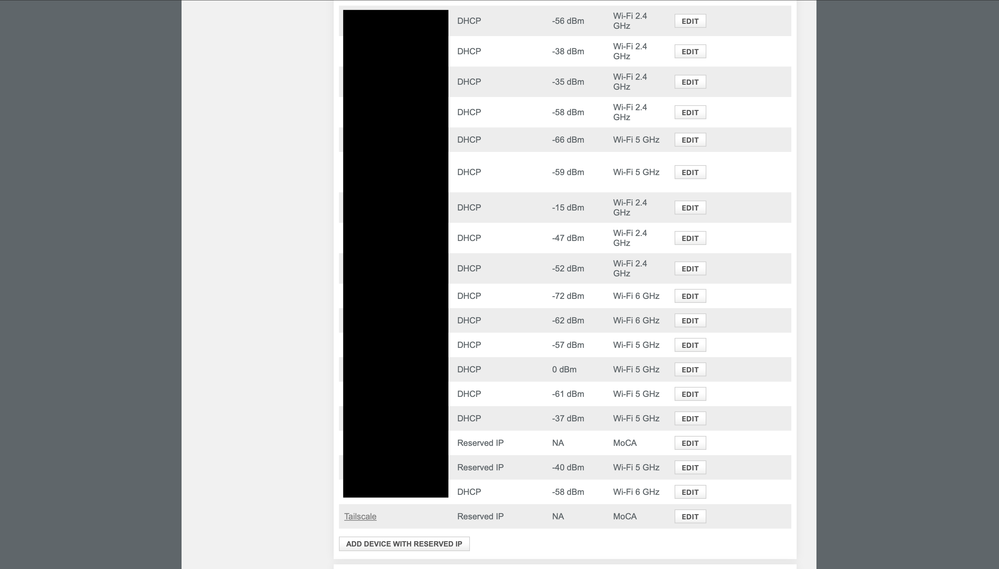
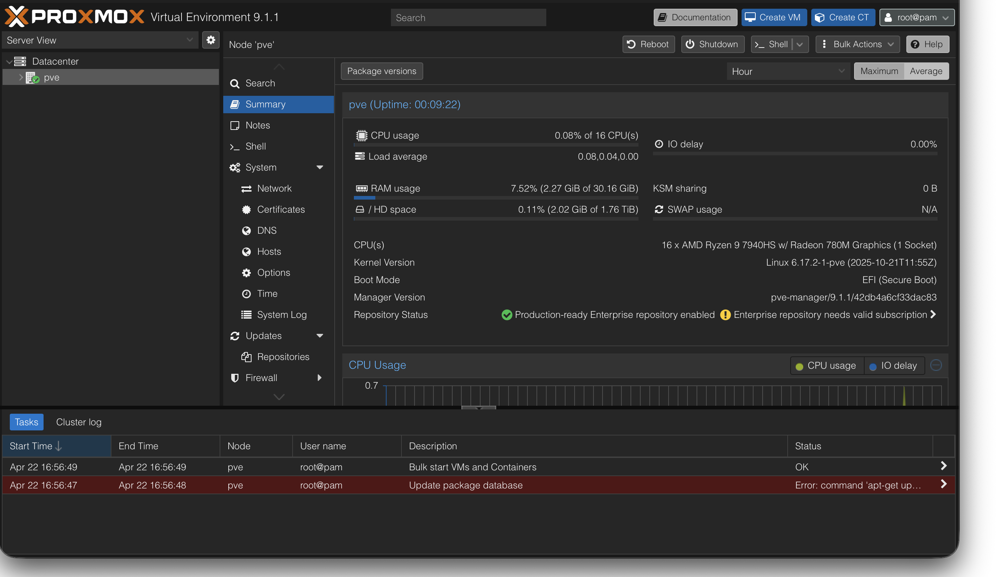
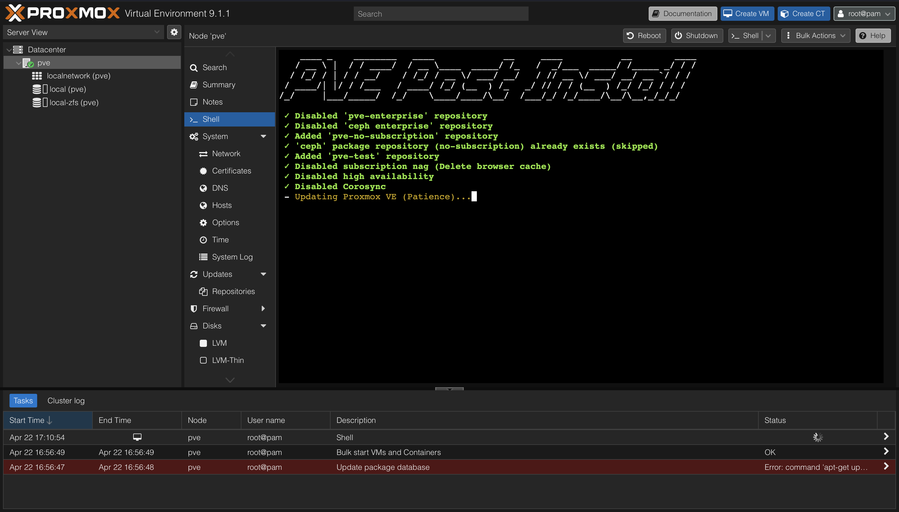
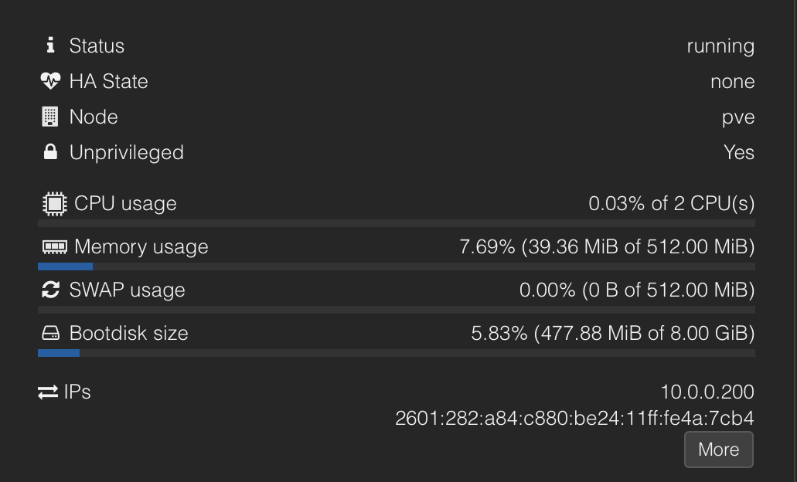
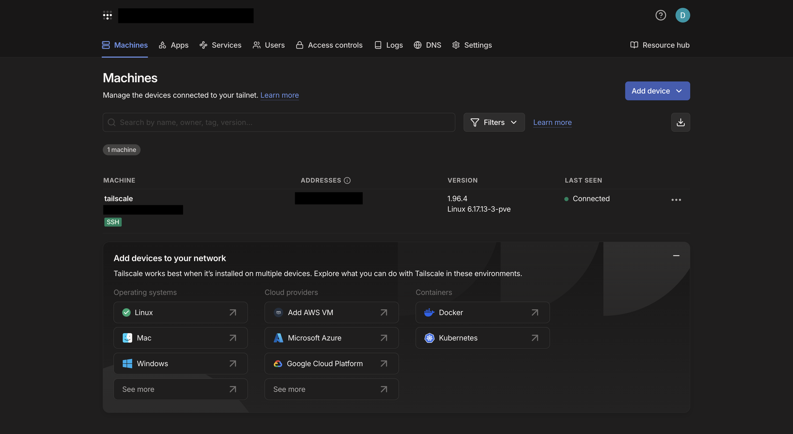
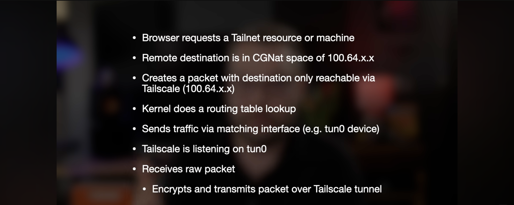

## Context

I've finally decided to do a full rebuild of my Proxmox homelab on my Minisforum 790 Pro mini PC (Ryzen 7940HS, 32GB DDR5, 2TB NVMe SSD). My previous implementations were a lot more disorganized in the way I set things up, so this time around I wanted to clearly and precisely configure things. And honestly, I needed a refresher on configuring Proxmox from scratch again.

## Lets Begin

### Imaging and Configuration

First, I flashed the latest **Proxmox VE** ISO to a 32GB USB with **Rufus**. Before booting the installer, I went into the BIOS of my mini PC and dropped the VRAM/UMA Buffer from 12GB down to 1GB, as I had it set up previously to run local AI models. Since I'm not gonna be running any GPU workloads on the iGPU itself (I have a spare RTX 3060 12GB I can pass through later for accelerated tasks), that memory is more useful returned to the system pool.


*VRAM/UMA Buffer reduced from 12GB to 1GB before install*

For storage, I chose **ZFS** over LVM. With a single drive there's no redundancy difference, but ZFS gives native snapshot support and a consistent foundation for when I add drives or set up replication to my UGREEN NAS later.

I then set a static IP via a DHCP reservation in the Xfinity gateway admin panel before I completed the installer. My previous time setting up Proxmox, I did not set a static IP initially and relied on DHCP, which caused way more headaches than I needed.



*DHCP reservation configured in the Xfinity gateway admin interface*

And just like that, I successfully did a fresh install!



*First successful Proxmox boot — web UI accessible on the local network*

### PVE Post Install Script

Once the web GUI was up, I ran the community PVE post install script. It disables the enterprise repo subscription nag, enables the no subscription repo, and applies a set of defaults that Proxmox doesn't configure out of the box. I also made sure to read through the script before running it and looked at their GitHub to see if it came from a legitimate source. Reading a script before piping curl to bash is just good practice as well.

```bash
bash -c "$(wget -qLO - https://github.com/community-scripts/ProxmoxVE/raw/main/misc/post-pve-install.sh)"
```



*I used Techno Tim's walkthrough alongside the community scripts docs as a guide.*

### Tailscale in an Unprivileged LXC

This was the meatiest section and the one I looked forward to the most to set up correctly and cleanly again. I didn't want to be bound to only being able to access my homelab when I'm on my home wifi.

I followed a great YouTube video from **Tailscale** explaining how to set up their product in Proxmox. I downloaded a Debian 13 template from the Proxmox template repository and created an unprivileged LXC container with a CT ID of 100. Below are the metrics of my LXC container (super lightweight):



*LXC container summary — CT ID 100, Debian 13, minimal resource allocation*

I specifically went with an unprivileged container over a privileged one for a few reasons. First, I didn't want to install Tailscale directly on the Proxmox host. The host is the hypervisor. If something goes sideways with Tailscale or I need to tear it out and reconfigure it, I don't want that touching the layer everything else runs on. Keeping it isolated in its own container means I can nuke and rebuild the container without any impact on my VMs or the host itself.

Second, unprivileged containers are just the safer default. They run with a remapped UID/GID namespace, so even if something inside the container were to get compromised, it can't trivially escape to the host with root access. Privileged containers don't have that boundary. The tradeoff is that unprivileged containers have more restrictions out of the box, which is exactly what I ran into next.

This is where I was led to find that unprivileged containers run with a remapped UID/GID namespace and restricted cgroup access by design. Tailscale requires `/dev/tun` to construct its WireGuard tunnel. The container has no access to it by default, and nothing in the Proxmox UI tells you that. Two lines had to be added to `/etc/pve/lxc/100.conf` on the host to fix it:

```
lxc.cgroup2.devices.allow: c 10:200 rwm
lxc.mount.entry: /dev/net/tun dev/net/tun none bind,create=file
```

The first line grants the container permission to access the TUN character device (major 10, minor 200) through cgroup2. The second line bind mounts `/dev/net/tun` from the host into the container filesystem. Both are required. The cgroup entry without the mount means the device path doesn't exist inside the container. The mount without the cgroup entry means the kernel denies access at the device level. You need both.

I also assigned a static IP to the container at this point since I forgot to do it during creation. I then ran a quick update and installed curl.

```bash
apt update && apt install -y curl
curl -fsSL https://tailscale.com/install.sh | sh
```

And Bam! Tailscale was finally up and running. I quickly set up an account on their website and configured IP forwarding so I could access the Proxmox Web UI and any other services on my local network.

```bash
# Enable IP forwarding so the container can route between the tailnet and the LAN
echo 'net.ipv4.ip_forward = 1' >> /etc/sysctl.conf
sysctl -p

# Advertise the home subnet
tailscale up --accept-routes --advertise-routes=10.0.0.0/24 --ssh
```

In the Tailscale admin panel at `login.tailscale.com/admin/machines`, I approved the advertised route under Edit route settings and disabled key expiry on the container node so it doesn't drop off the tailnet after 180 days.



*Tailscale connectivity confirmed with the subnet router active*

## Things I Found Interesting



*Diagram showing how the TUN device interfaces with the kernel — useful context for what the cgroup entries are actually granting*

## Key Takeaways

Configuring the BIOS VRAM, flashing a USB using **Rufus**, and setting up Proxmox again was a pretty easy task. It did refresh my memory on some of the nuances and led me to choose ZFS over LVM as my filesystem this time around. The bulk of my learning stemmed from installing Tailscale, particularly setting up an LXC container, configuring TUN, and a subnet router for easier access to all my local network resources. However, this is just the beginning!

Part 2 will cover me setting up Wazuh in a VM alongside pfSense and Suricata. 👀

## References

- [community scripts PVE post install](https://community-scripts.org/scripts/post-pve-install?id=post-pve-install)
- [Techno Tim: Proxmox post install walkthrough](https://www.youtube.com/watch?v=kcpu4z5eSEU&t=142s)
- [Tailscale install script](https://tailscale.com/install.sh)
- [Tailscale subnet routing docs](https://tailscale.com/kb/1019/subnets)
