## Goal

To install and configure Wazuh on my proxmox homelab

I first started by visiting the official documentation for wazuh to get myself familiar.

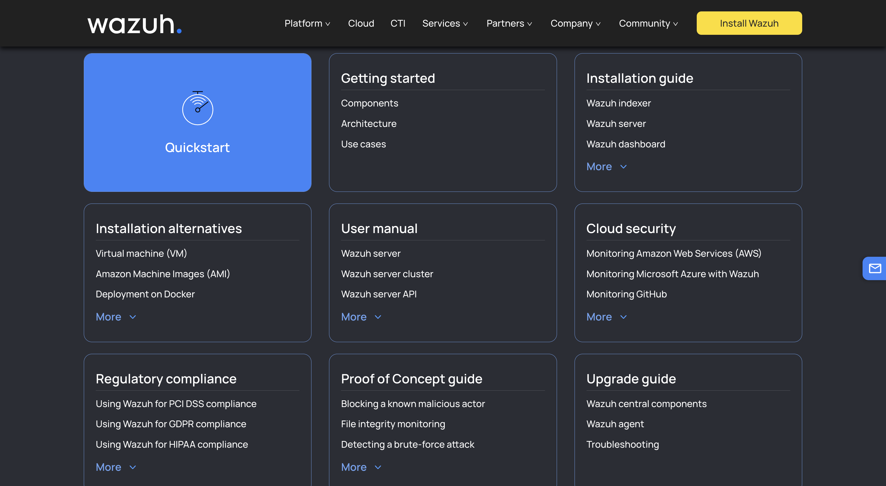

There are four components to the Wazuh system. Wazuh Indexer, Wazuh Server, Wazuh Dashboard, and Wazuh Agent

- Wazuh Indexer stores data as JSON documents "Each document correlates a set of keys, field names, or properties with their corresponding values, which can be strings, numbers, Boolean values, dates, arrays of values, geolocations, or other types of data."
- The Indexer is very low latency and allows for near real time analysis
- The Wazuh server is the central component responsible for analyzing data collected from Wazuh agents and agentless devices. It detects threats, anomalies, and regulatory compliance violations in real time, generating alerts when suspicious activity is identified. Beyond detection, the Wazuh server enables centralized management by remotely configuring Wazuh agents and continuously monitoring their operational status.

Below is a diagram of the Wazuh Server Architechture

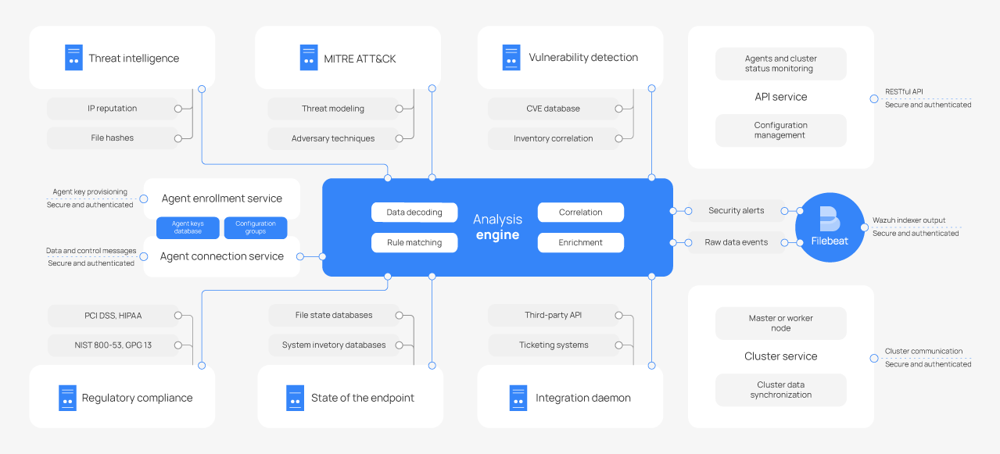

Below is a diagram of the Wazuh Agent Architecture

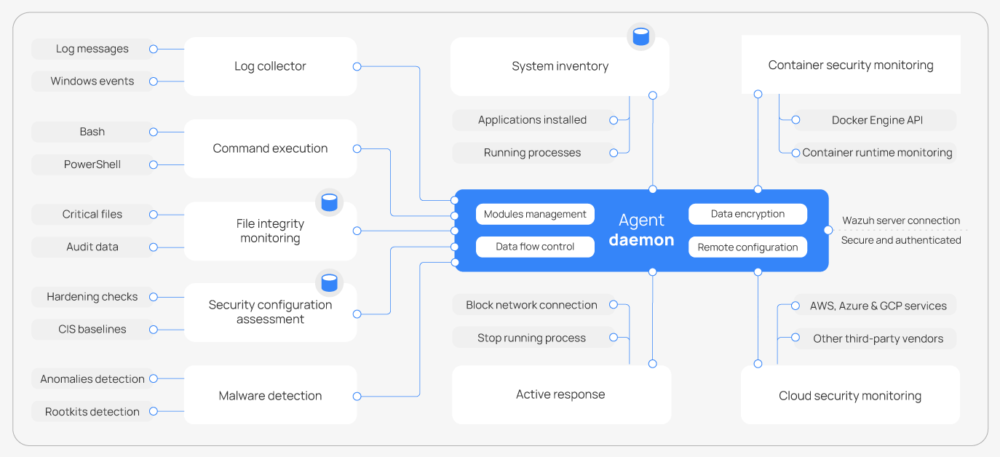

I'll be deploying Wazuh server, Wazuh indexer, and the Wazuh dashboard on the same host as a distributed deployment would be way too overkill for my use case.

I then downloaded Ubuntu 24.04 LTS, as it's the newest version of Ubuntu that Wazuh officialy supports. I then proceeded to add the ISO image to my proxmox, and configure the VM as shown below:

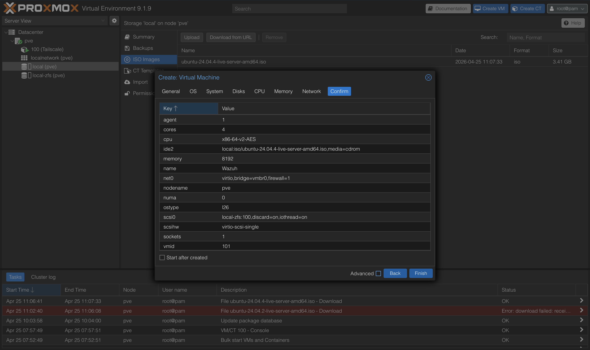

During the Ubuntu Server Install, I set a DHCP reservation in my Xfinity Gateway interface and then assigned it a static ip within the installer:

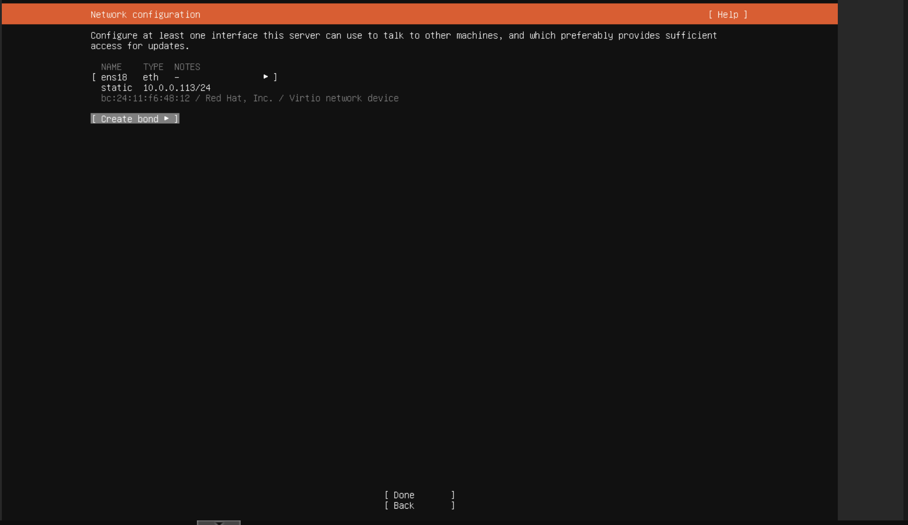

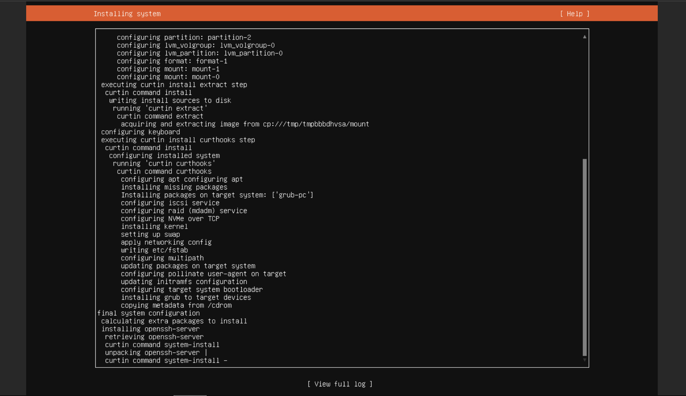

After successfully installing Ubuntu, I realized that the 100GB's of drive space I allocated was not being used fully by LVM. I ssh'ed from my macbook and then ran these following commands to fix the LVM to use the entirety of the drive.

```bash
sudo lvextend -l +100%FREE /dev/ubuntu-vg/ubuntu-lv
sudo resize2fs /dev/ubuntu-vg/ubuntu-lv
df -h /
```

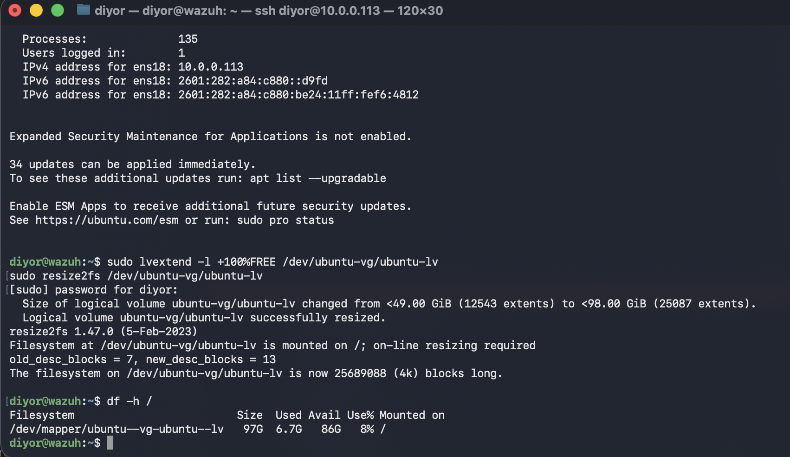

I then ran a quick sudo apt update and upgrade to ensure Ubuntu was up to date and then ran a curl command to install the Wazuh Installation assistant

```bash
curl -sO https://packages.wazuh.com/4.14/wazuh-install.sh && sudo bash ./wazuh-install.sh -a
```

After successfully installing, I managed to access the web dashboard for the first time!

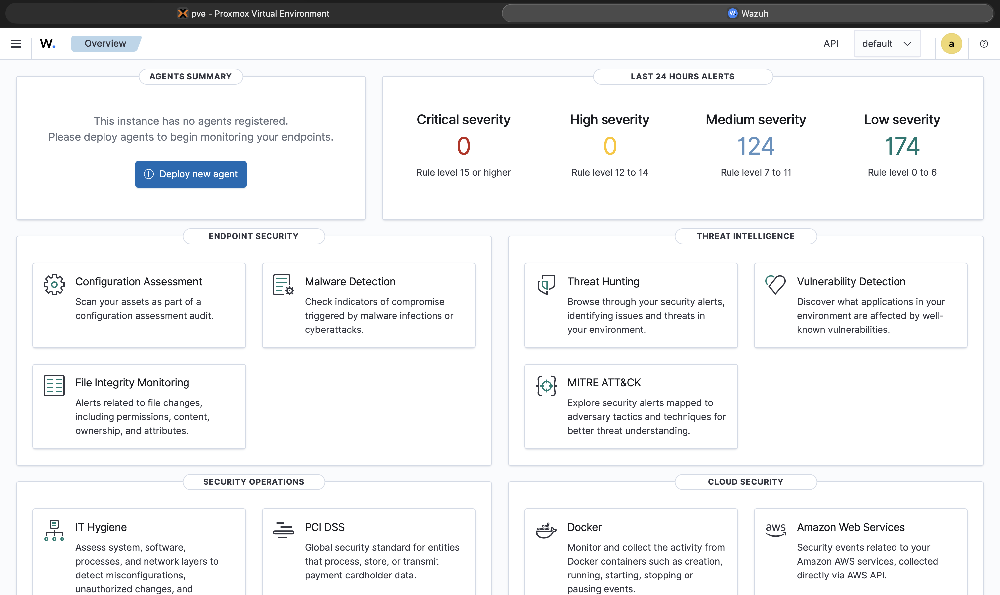

Now it's time to create some vms and set up Wazuh Agents within them.

I created a Ubuntu 26.04 Desktop VM, to serve as my first VM I can deploy my Wazuh Agent onto it.

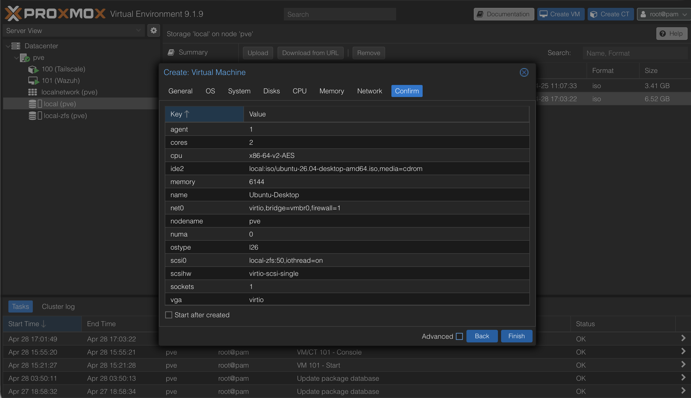

After going through the Ubuntu Installer, setting a static IP, and enabling SSH for ease of access, I installed the Wazuh Agent onto it.

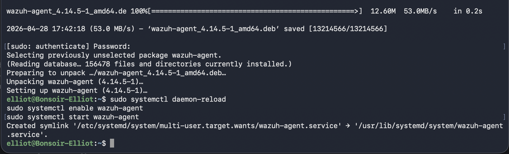

I then SSH'ed via my mac terminal so I can easily copy and paste the wget commands to install the agent. I then ran systemctl to enable the agent. I returned back to the Wazuh Dashboard and it was successfully working!

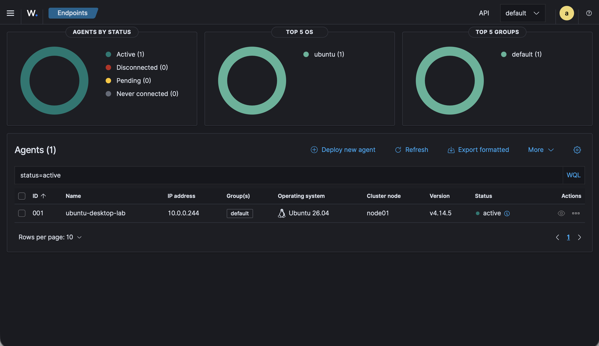

In part 3, I'll go deeper into the configs and rulesets for Wazuh!

## References

- [Wazuh Website](https://wazuh.com)
